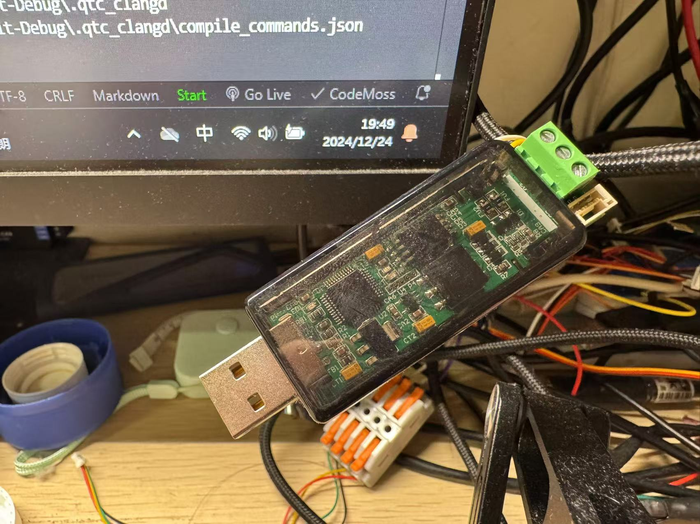

## Communication Protocol

[go Back](../README.md)

First, connect the USB-CAN module to the computer.

## Setting Servo Angle

The serial command for setting the servo angle is 16 bytes in length, detailed as follows:

| Command Index | Hex Value         |
|---------------|-------------------|
| 0             | AA                |
| 1             | 00                |
| 2             | 00                |
| 3             | 08                |
| 4             | 00                |
| 5             | 00                |
| 6             | High byte of ID   |
| 7             | Low byte of ID    |
| 8             | 01                |
| 9             | Servo Number      |
| 10            | High byte of Angle|
| 11            | Low byte of Angle |
| 12            | 00                |
| 13            | 00                |
| 14            | 00                |
| 15            | 00                |

Angle Correspondence: The physical servo angle ranges from 0 to 180 degrees, corresponding to an electrical servo angle ranging from 0 to 2000.

## Pressure Reading

The pressure data format returned by the sensor is as follows:

The sensor ID is calculated as 2047 minus the set sensor ID (default is 33).

| Command Index | Hex Value              |
|---------------|------------------------|
| 0             | AA                     |
| 1             | 00                     |
| 2             | 00                     |
| 3             | 08                     |
| 4             | 00                     |
| 5             | 00                     |
| 6             | High byte of ID        |
| 7             | Low byte of ID         |
| 8             | Pressure Sensor Number |
| 9             | High byte of Pressure Data |
| 10            | Low byte of Pressure Data  |
| 11            | 00                     |
| 12            | 00                     |
| 13            | 00                     |
| 14            | 00                     |
| 15            | 00                     |

