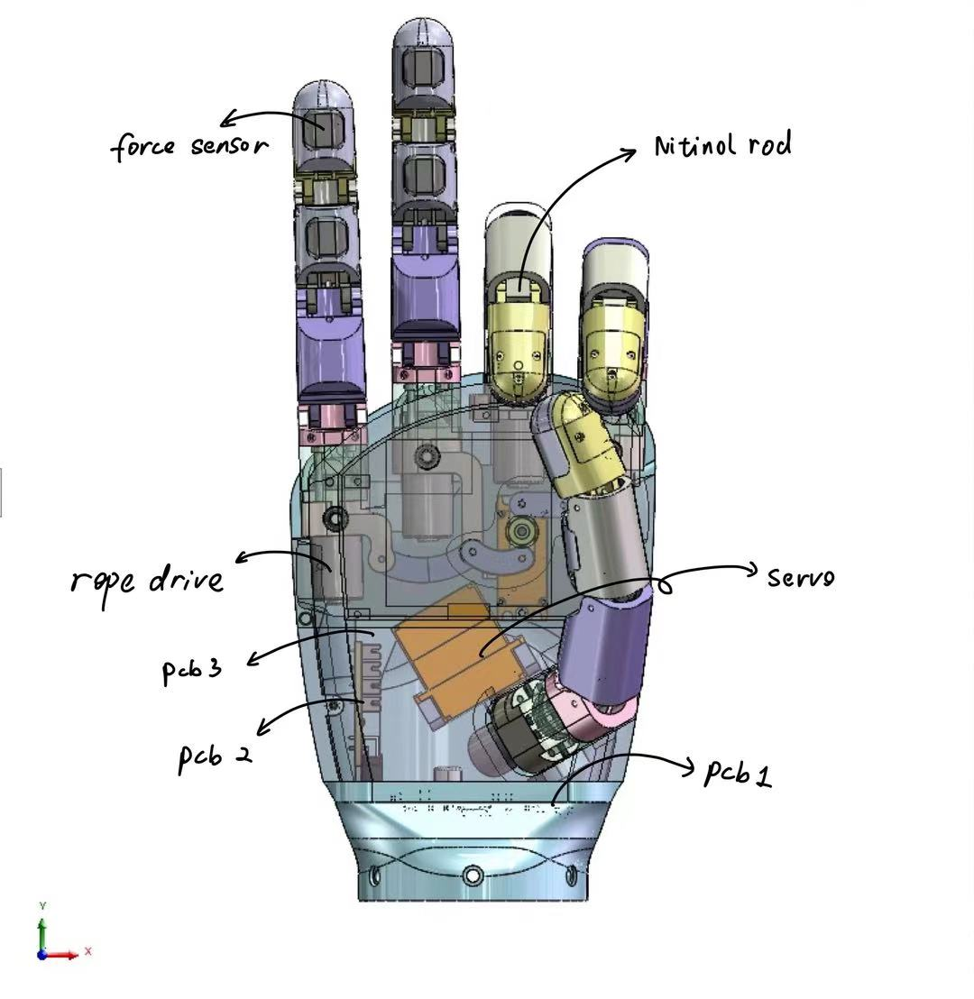
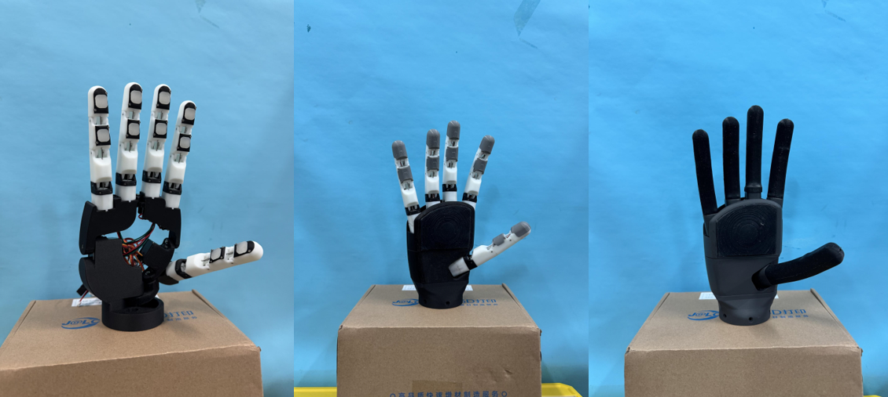

# RopeGod
[](./README.md)
[](./README-zh_cn.md)

## 介绍
RopeGod 是一个高集成低成本的绳驱五指灵巧手，共有7个自由度

每个指节装有2个压力传感器，共计11个力传感器。


## 性能参数

| 指标               | 参数      |
|--------------------|-----------|
| 重量               | 346g      |
| 成本               | <60$      |
| 传感器数量         | 11        |
| 自由度             | 7         |
| 最大单指下压力     | 8N        |
| 最大提拉重量       | 2Kg       |
| 供电电压           | 12 ~ 24V  |
| 最大电流           | 1.5A      |
| 通信               | CAN       |

## 机械结构



除了舵机和空心杯电机外，其余所有组件都是自主设计的，可以通过3D打印，3D打印模具进行硅胶翻模，基础的机械加工来完成。模型请见 `/0.Model`

目前，我们的驱动结构还处于一块驱动板驱动多个自由度。下一步，我们正在向着单根手指模块化设计的方向发展，希望将驱动、控制、电流反馈，集成到单根手指内，而手指与手指之间直接采用总线通信。这样可以进一步加强模块化设计，减少空间、资源浪费。

## 电路设计

手掌中一共有三块电路

- 电机驱动板
- 扩展板（用来提供驱动器接口）
- 传感器采样板

分布式的电路设计可以进一步减少空间占用，提高集成度。同时还提供了很高的灵活性，例如，可以通过更换传感器板子来实现对多种传感器的适应（比如视触觉传感器）。

主控板使用STM32F103C8T6进行电机控制，每根手指的空心杯电机中我们都配有一个电阻编码器和闭环控制板。这样主控只需要提供稳定的12V电压和准确的PWM信号便可以像控制舵机一样控制绳驱驱动器了。

传感器板主控使用STM32F103VET6，主要是考虑到其ADC通道数量相较于较小封装STM32F1的优势

原理图和PCB设计请见 `/1.Hardware`


## 固件

主控板和传感器板均使用 STM32CubeIDE 开发

源代码请见 `2.Frimware`

## 通信

由于 STM32 配有 CAN 控制器外设，所以我们只需要额外配置一个 TJA1042 收发器即可，这已经配置在了主控板和传感器板上，二者均接入了 CAN 网络。

通信协议详见：[通信协议](./4.Docs/)

## 上位机

为了便于操作和数据采集，我们使用 QT 开发了上位机

目前支持的功能有：

1. 7个自由度的位置闭环控制
2. 串口连接 UAB-CAN 控制器
3. 关节角度参数显示
4. 4种基础动作的执行（捏合、球状抓取、侧捏夹取、柱状握持）
5. 设置灵巧手和传感器的 CANID
6. 12路压力传感器的图表显示

上位机源代码请见 `./3.Software`，预编译版本在 release 中发布（目前只有 Windows 下的预编译版本）

目前上位机对高分辨率屏幕的支持并不好，在后续的版本中我们将修复这个问题


## 库函数和接口

我们提供了 C++ 和 Python 的库函数接口，便于使用者进行二次开发

详见 `./3.Software`

C++ 中创建灵巧手对象

```cpp
WzSerialPort w;
mrh5 mr1(w, 32, 33); 
```

控制频率应当 <200 Hz

## 视频演示

自由度演示：链接1

自主完成 9 种物体的抓取并使用扫码枪扫描条形码：链接2

使用连续体灵巧手完成薯片、鸡蛋等物体的抓取：链接3

## 衍生项目

- 连续体灵巧手
- 变胞灵巧手



## 许可证

Choloepus采用AGPL-3.0许可证进行发布。请参考[LICENSE](https://github.com/CassiusXiang/Choloepus/blob/main/LICENSE)获取更多信息。

## 联系方式

我的邮箱: changxiangchina@outlook.com

