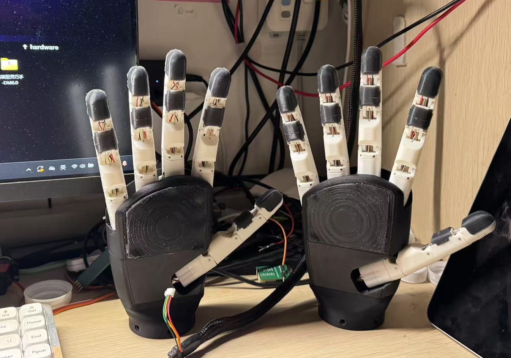
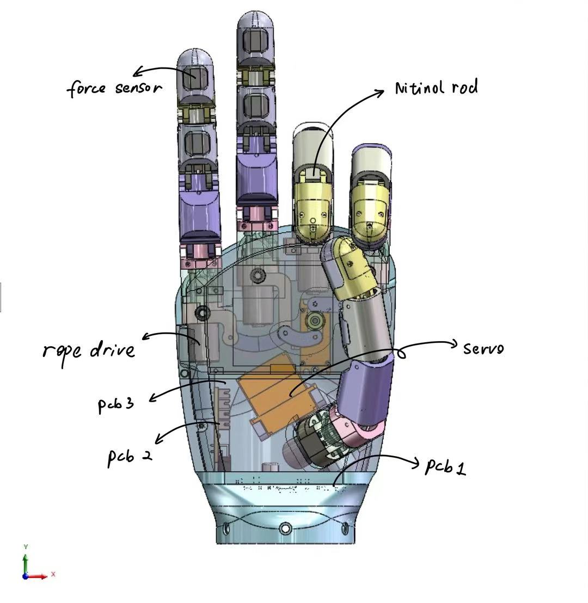
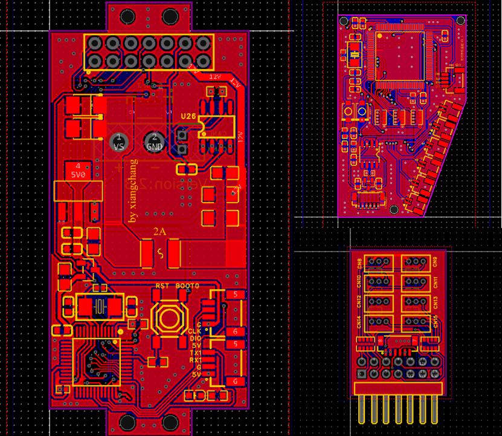
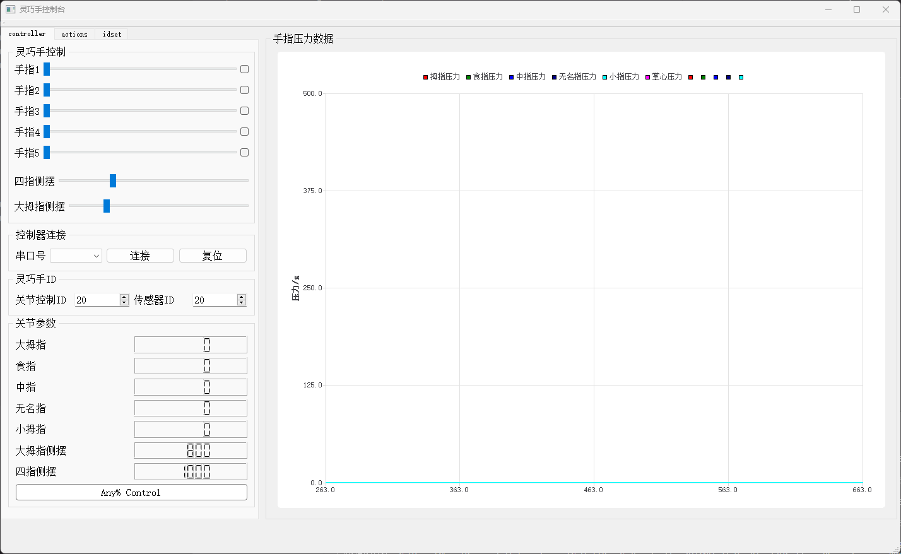

# RopeGod
[](./README.md)
[](./README-zh_cn.md)

## Introduction
RopeGod is a highly integrated and low-cost rope-driven five-finger dexterous hand with a total of 7 degrees of freedom.

Each finger segment is equipped with 2 pressure sensors, making a total of 11 force sensors.



## Performance Parameters

| Parameter              | Value    |
|------------------------|----------|
| Weight                 | 346g     |
| Cost                   | <60$     |
| Number of Sensors      | 11       |
| Degrees of Freedom     | 7        |
| Maximum Single-Finger Downward Force | 8N   |
| Maximum Lifting Weight | 2Kg      |
| Power Supply Voltage   | 12 ~ 24V |
| Maximum Current        | 1.5A     |
| Communication          | CAN      |

## Mechanical Structure



Except for the servos and coreless motors, all other components are independently designed. They can be manufactured via 3D printing, silicone molding with 3D-printed molds, and basic mechanical processing. The models can be found in `/0.Model`.

Currently, our drive structure still involves a single driver board controlling multiple degrees of freedom. Going forward, we are shifting toward a modular design for individual fingers, aiming to integrate drive, control, and current feedback into a single finger, with inter-finger connections using a bus for communication. This will further enhance modular design and reduce space and resource waste.

## Circuit Design

There are three circuit boards inside the palm:
- Motor driver board
- Expansion board (provides driver interfaces)
- Sensor sampling board

This distributed circuit design can further reduce space usage and improve integration. It also offers high flexibility. For example, by changing the sensor board, you can adapt to various sensors (e.g., visual-tactile sensors).

The main control board uses the STM32F103C8T6 for motor control. Each finger’s coreless motor comes with a resistance-based encoder and a closed-loop control board. Therefore, the main controller only needs to supply a stable 12V and an accurate PWM signal to control the rope-driven actuators similarly to controlling servos.

The sensor board uses the STM32F103VET6 as the main controller, primarily because it offers more ADC channels compared to smaller-packaged STM32F1 versions.

Refer to `/1.Hardware` for schematics and PCB designs.



## Firmware

Both the main control board and the sensor board are developed using STM32CubeIDE.

Source code can be found in `2.Firmware`.

## Communication

Since the STM32 series is equipped with a CAN controller peripheral, we only need to add a TJA1042 transceiver. This has already been configured on both the main control board and the sensor board, and both are connected to the CAN network.

For details on the communication protocol, see: [Communication Protocol](./4.Docs/)

## Upper Computer (Host Software)

We use QT to develop a host software application for convenient operation and data collection.

Currently supported features:
1. Closed-loop position control of 7 degrees of freedom
2. Serial connection to a USB-CAN controller
3. Display of joint angle parameters
4. Execution of 4 basic actions (pinch, spherical grasp, lateral pinch, cylindrical grasp)
5. Setting the CAN IDs of the dexterous hand and sensors
6. Chart display of 12 pressure sensor readings

The source code of the upper computer software can be found in `./3.Software`. A pre-compiled version is published in the release section (currently only Windows).

Support for high-resolution screens is not ideal at the moment. We plan to fix this in subsequent releases.



## Libraries and Interfaces

We provide both C++ and Python library interfaces for convenient secondary development.

See `./3.Software` for details.

Creating a dexterous hand object in C++:
```cpp
WzSerialPort w;
mrh5 mr1(w, 32, 33); 
```

The control frequency should be <200 Hz.

## Video Demonstration
- Degrees of freedom demo: Link 1
- Automatically grasping 9 types of objects and using a barcode scanner to scan barcodes: Link 2
- Using a continuum dexterous hand to grasp fragile items like chips and eggs: Link 3

## Derivative Projects
- Continuum Dexterous Hand
- Metamorphic Dexterous Hand


## License
Choloepus is released under the AGPL-3.0 License. Please refer to [LICENSE](https://github.com/CassiusXiang/Choloepus/blob/main/LICENSE) for more information.

## Contact
Email: changxiangchina@outlook.com


